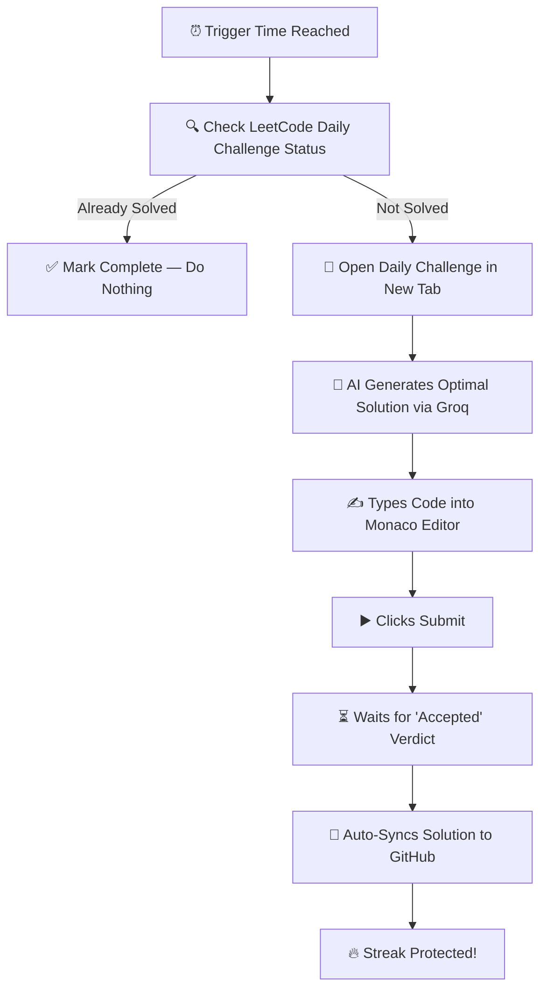
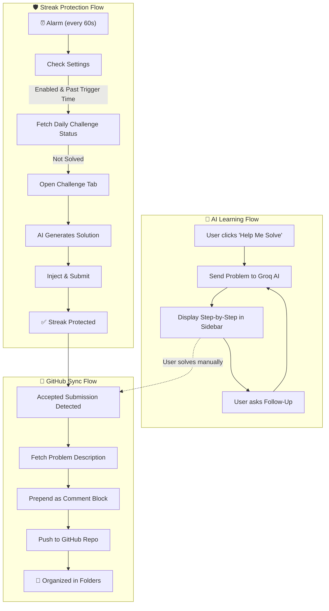

<div align="center">


<br />

# ⚡ LeetCode Companion

### Never Lose Your LeetCode Streak Again — AI Auto-Solves, Teaches You How, and Syncs Everything to GitHub

<br />

[](https://chrome.google.com/webstore)
[](https://developer.chrome.com/docs/extensions/mv3/)
[](LICENSE)
[](https://github.com/Satyam810/leetcode-companion/pulls)

[](https://developer.mozilla.org/en-US/docs/Web/JavaScript)
[](https://console.groq.com)
[](https://docs.github.com/en/rest)
[](https://developer.chrome.com/docs/extensions/)

<br />

🛡️ **Auto-Solve Streak Protection** · 🤖 **AI-Powered Learning** · 🔄 **Automatic GitHub Sync** · 📊 **Progress Dashboard**

<br />

[🛡️ Streak Protection](#%EF%B8%8F-feature-1--streak-protection-auto-solve) · [🤖 AI Assistant](#-feature-2--ai-powered-learning-assistant) · [🔄 GitHub Sync](#-feature-3--intelligent-github-sync) · [🚀 Install](#-installation) · [⚙️ Setup](#%EF%B8%8F-setup-guide)

<br />

---

</div>

## 🎯 The Problem

You've been grinding LeetCode for **47 days straight**. You have a meeting, an exam, a deadline — and by the time you remember, it's midnight. **Streak gone. 47 days wasted.**

Or maybe you solved a problem, but forgot to save the code. Now it's lost in LeetCode's submission history. No GitHub profile contribution. No portfolio to show for your hard work.

**LeetCode Companion solves all of this — automatically.**

<br />

## 💡 What Makes This Different?

This is **NOT** just another "sync LeetCode to GitHub" tool.

Most extensions only push your code to a repo. That's it. LeetCode Companion is a **complete AI-powered workflow** that:

<table>
<tr>
<td align="center" width="33%">
<h3>🛡️ Protects</h3>
<p>Auto-solves the daily challenge when you can't, so your streak <b>never breaks</b></p>
</td>
<td align="center" width="33%">
<h3>🧠 Teaches</h3>
<p>AI explains problems step-by-step so you actually <b>learn and grow</b></p>
</td>
<td align="center" width="33%">
<h3>🔄 Records</h3>
<p>Every solution auto-syncs to GitHub, building your <b>coding portfolio</b></p>
</td>
</tr>
</table>

> **🔑 One extension. Three superpowers. Zero effort.**

<br />

---

## ✨ Features

<br />

### 🛡️ Feature 1 — Streak Protection (Auto-Solve)

> **The killer feature.** Set a time. Forget about it. Your streak is safe forever.

LeetCode resets the daily challenge at midnight UTC. If life gets in the way and you can't solve it, LeetCode Companion has your back. Here's exactly what happens:

```
⏰ You set trigger time to 10:00 PM
📋 Every 60 seconds, the extension checks: "Did the user solve today's daily challenge?"
✅ If YES → silently marks the day as done. Nothing happens.
❌ If NO and it's past 10:00 PM → Auto-solve activates:
```

**The Auto-Solve Pipeline:**



**How it works under the hood:**

| Step | What Happens | Technical Detail |
|------|-------------|------------------|
| 1 | **Alarm fires every 60s** | Chrome `alarms` API with 1-minute interval |
| 2 | **Checks your solve status** | LeetCode GraphQL API with authenticated session cookies |
| 3 | **Fetches daily challenge** | Gets problem slug, title, difficulty, and user status |
| 4 | **Opens tab in foreground** | Prevents Chrome from throttling background JS timers |
| 5 | **AI generates solution** | Groq LLaMA 3.3 70B produces optimal, working code |
| 6 | **Injects into editor** | Page-level bridge reads/writes Monaco editor directly |
| 7 | **Submits & verifies** | Watches DOM for "Accepted" status mutation |
| 8 | **Syncs to GitHub** | Pushes with problem description as code comment |

> **💡 Smart deduplication** — If you solve the problem manually at any point during the day, the auto-solver detects it and does nothing. No duplicate submissions. No duplicate GitHub commits.

---

### 🤖 Feature 2 — AI-Powered Learning Assistant

> **Don't just solve problems. Understand them.**


When you're stuck on a problem, click **"Help Me Solve"** and the AI assistant provides:

<table>
<tr>
<td width="50%">

**🎯 Step-by-Step Approach**
- Breaks down the problem into digestible steps
- Identifies the underlying pattern (Two Pointers, DP, Graph, etc.)
- Walks through the approach from brute force to optimal
- Analyzes time & space complexity with Big-O notation

</td>
<td width="50%">

**💬 Interactive Follow-Up Chat**
- Ask questions in natural language: *"Why not use a hash map here?"*
- Request optimizations: *"Can this be done in O(n)?"*
- Clarify edge cases: *"What if the array is empty?"*
- Full conversation history maintained across messages

</td>
</tr>
</table>

**The AI doesn't just give you answers — it teaches you the thought process:**

```
You: "Help me solve Two Sum"

AI: "## Approach
     
     ### 1. Brute Force (O(n²))
     Check every pair of numbers...
     
     ### 2. Optimal: Hash Map (O(n))  ← Recommended
     As we iterate, store each number's complement in a hash map.
     When we find a number that exists in the map, we've found our pair.
     
     ### Key Insight
     Instead of asking 'what pairs sum to target?',
     ask 'have I seen target - current before?'
     
     ### Complexity
     - Time: O(n) — single pass through the array
     - Space: O(n) — hash map stores at most n elements"
```

<details>
<summary><b>🧩 Supported AI Models (Auto-Fallback Chain)</b></summary>
<br />

The extension automatically tries models in priority order. If one is rate-limited or unavailable, it seamlessly falls back to the next:

| Priority | Model | Speed | Quality | Notes |
|----------|-------|-------|---------|-------|
| 1st | `llama-3.3-70b-versatile` | ⚡⚡ | ⭐⭐⭐⭐⭐ | Default — best quality |
| 2nd | `llama-3.1-8b-instant` | ⚡⚡⚡ | ⭐⭐⭐ | Ultra-fast responses |
| 3rd | `mixtral-8x7b-32768` | ⚡⚡ | ⭐⭐⭐⭐ | Great for code generation |
| 4th | `llama3-8b-8192` | ⚡⚡⚡ | ⭐⭐⭐ | Standard fallback |
| 5th | `llama3-70b-8192` | ⚡⚡ | ⭐⭐⭐⭐ | Large fallback |

> **100% Free** — Powered by [Groq](https://console.groq.com). No credit card. No usage charges. Just sign up and get your API key.

</details>

---

### 🔄 Feature 3 — Intelligent GitHub Sync

> **Every problem you solve automatically becomes a GitHub contribution.**


This is **not** a simple code dump. Every synced solution is enriched and organized:

**🧠 Problem Statement Included:**
```python
"""
Given an array of integers nums and an integer target, return indices
of the two numbers such that they add up to target.

You may assume that each input would have exactly one solution, and
you may not use the same element twice.

Example 1:
  Input: nums = [2,7,11,15], target = 9
  Output: [0,1]
  Explanation: Because nums[0] + nums[1] == 9, we return [0, 1].
"""

class Solution:
    def twoSum(self, nums: List[int], target: int) -> List[int]:
        seen = {}
        for i, num in enumerate(nums):
            complement = target - num
            if complement in seen:
                return [seen[complement], i]
            seen[num] = i
```

**📁 Clean Repository Structure:**
```
📂 leetcode-solutions/
│
├── 📂 two-sum/
│   └── 📄 solution.py              ← includes full problem description
│
├── 📂 valid-parentheses/
│   └── 📄 solution.js              ← with JSDoc-style problem header
│
├── 📂 merge-k-sorted-lists/
│   └── 📄 solution.cpp             ← with /* */ comment block
│
├── 📂 longest-palindromic-substring/
│   └── 📄 solution.java
│
└── ... (auto-organized by problem slug)
```

**Two Sync Modes:**

| Mode | How It Works | When It Triggers |
|------|-------------|-----------------|
| **🤖 Auto-Sync** | Detects "Accepted" verdict automatically | Instantly after every successful submission |
| **👆 Manual Sync** | Click "Sync to GitHub" in popup or sidebar | On-demand, whenever you want |

**Smart Features:**
- ✅ **Deduplication** — already synced? Skips the push. No duplicate commits.
- ✅ **Problem description prepend** — every file includes the question as a comment block
- ✅ **Language-aware formatting** — `"""docstrings"""` for Python, `/* block comments */` for C++/Java/JS
- ✅ **12 languages supported** — Python, JavaScript, TypeScript, Java, C++, C#, Go, Rust, Kotlin, Swift, Ruby, Scala

---

### 📊 Feature 4 — Progress Dashboard

A beautiful, compact popup that shows your LeetCode journey at a glance:

<table>
<tr>
<td align="center" width="25%">
<h2 style="color: #34d399;">39</h2>
<sub><b>EASY</b></sub>
</td>
<td align="center" width="25%">
<h2 style="color: #fbbf24;">56</h2>
<sub><b>MEDIUM</b></sub>
</td>
<td align="center" width="25%">
<h2 style="color: #f87171;">16</h2>
<sub><b>HARD</b></sub>
</td>
<td align="center" width="25%">
<h2 style="color: #818cf8;">🔥 2</h2>
<sub><b>STREAK</b></sub>
</td>
</tr>
</table>

- 📈 **Real-time stats** — synced from LeetCode's API
- 🔥 **Current & longest streak** tracking
- 🟢 **Connection status** — see if GitHub is connected at a glance
- 🔄 **One-click refresh** — pull latest stats instantly

---

### 🎨 Feature 5 — Premium UI/UX

Built with the polish of a SaaS product, not a side project:

- **Dark glassmorphic design** — Inter font, indigo/violet accent palette, radial gradients
- **Draggable floating sidebar** — position the AI panel anywhere on the LeetCode page
- **Snapping toggle button** — drag to any screen edge; it magnetically snaps and stays put
- **Smooth micro-animations** — scale reveals, hover glow effects, animated status indicators
- **Compact 380px popup** — stat cards, quick actions, and streak protection in one view
- **SaaS-grade settings page** — glassmorphic cards, focus rings, status badges

<br />

---

## 🚀 Installation

### Option 1: Chrome Web Store (Recommended)
1. Visit the [Chrome Web Store listing](https://chrome.google.com/webstore) *(link coming soon)*
2. Click **"Add to Chrome"**
3. Pin the extension to your toolbar for quick access

### Option 2: Install from Source (Developers)

```bash
# 1. Clone the repository
git clone https://github.com/Satyam810/leetcode-companion.git
cd leetcode-companion

# 2. Load in Chrome
#    → Navigate to chrome://extensions
#    → Enable "Developer mode" (top-right toggle)
#    → Click "Load unpacked"
#    → Select the cloned project folder

# ✅ That's it! No build step. No npm install. Pure vanilla JS.
```

<br />

## ⚙️ Setup Guide

### Step 1: Get Your Free AI Key (Groq)

1. Go to **[console.groq.com](https://console.groq.com)** and sign up *(free, no credit card)*
2. Navigate to **API Keys** → **Create API Key**
3. Copy the key *(starts with `gsk_...`)*

> 💡 Groq provides **free, blazing-fast** LLM inference. No billing setup required.

### Step 2: Create a GitHub Personal Access Token

1. Go to **[GitHub → Settings → Developer Settings → Tokens (classic)](https://github.com/settings/tokens)**
2. Click **"Generate new token (classic)"**
3. Select scope: **`repo`** *(full control of private repositories)*
4. Copy the generated token

### Step 3: Create Your Solutions Repository

Create a new GitHub repository (public or private) where your solutions will be stored.
Example: `leetcode-solutions`

### Step 4: Configure the Extension

1. Click the **LeetCode Companion** icon in your Chrome toolbar
2. Click the **⚙️ Settings** button
3. Fill in your credentials:

| Field | Value | Example |
|-------|-------|---------|
| **Groq API Key** | Your Groq key | `gsk_abc123...` |
| **GitHub Token** | Your PAT | `ghp_xyz789...` |
| **GitHub Repo** | `owner/repo` format | `Satyam810/leetcode-solutions` |
| **Branch** | Target branch | `main` |
| **Folder** | Optional path prefix | `leetcode/` *(or leave empty)* |

4. Click **Save Settings**
5. Click **Test Connection** to verify both APIs are working ✅

### Step 5: Enable Streak Protection

1. In the main popup, toggle **"Auto-Solve Problem"** → ON
2. Set your trigger time *(e.g., `10:00 PM`)*
3. Done! If you forget to solve, the extension handles it automatically

<br />

## 🏗️ Architecture

```
leetcode-companion/
│
├── manifest.json                    # Chrome Extension Manifest V3
├── .env                             # API keys (git-ignored)
│
├── 📂 assets/
│   ├── 📂 icons/                    # Extension icons (16/48/128px)
│   └── 📂 screenshots/             # README images
│
└── 📂 src/
    │
    ├── 📂 background/
    │   └── service-worker.js        # MV3 Service Worker (the brain)
    │       ├── Streak alarm         #   → 1-minute check interval
    │       ├── Auto-solve engine    #   → AI generation + tab orchestration
    │       ├── GitHub sync          #   → Push with problem description
    │       ├── Stats tracking       #   → Difficulty counters + streak math
    │       └── Message router       #   → Handles all extension messages
    │
    ├── 📂 content/
    │   ├── detector.js              # Submission Detector
    │   │   ├── URL observer         #   → Watches for page navigation
    │   │   ├── DOM mutation watch   #   → Detects "Accepted" verdict
    │   │   └── Auto-sync trigger    #   → Fires ACCEPTED_SUBMISSION message
    │   │
    │   ├── injector.js              # UI Injector (the face)
    │   │   ├── Floating sidebar     #   → Draggable AI chat panel
    │   │   ├── Snapping toggle      #   → Edge-snapping floating button
    │   │   ├── Auto-solve UI        #   → Progress indicators + status
    │   │   └── Manual sync button   #   → One-click GitHub push
    │   │
    │   └── editor-injector.js       # Monaco Bridge
    │       ├── Read code            #   → Extracts full editor content
    │       └── Write code           #   → Injects AI-generated solutions
    │
    ├── 📂 lib/
    │   ├── groq-api.js              # AI Client
    │   │   ├── Multi-model fallback #   → 5 models, auto-retry chain
    │   │   ├── Chat mode            #   → Full conversation history
    │   │   └── Single-shot mode     #   → One-off solution generation
    │   │
    │   ├── github-api.js            # GitHub REST Client
    │   │   ├── Create/update files  #   → Base64 content encoding
    │   │   └── SHA resolution       #   → Handles update conflicts
    │   │
    │   └── storage.js               # Storage Abstraction
    │       ├── Settings (sync)      #   → API keys, preferences
    │       ├── Stats (local)        #   → Problem counts by difficulty
    │       └── Streak (local)       #   → Current/longest streak tracking
    │
    └── 📂 popup/
        ├── popup.html / popup.js    # Main Dashboard
        └── settings.html / settings.js  # Configuration Page
```

### Data Flow



<br />

## 🔐 Privacy & Security

We take your privacy seriously. Here's exactly what we access and why:

| What | Access Level | Purpose |
|------|-------------|---------|
| **API Keys** | Stored in Chrome's encrypted `storage.sync` | Never sent anywhere except their respective APIs |
| **Your Code** | Sent to Groq (AI) and GitHub (sync) only | Zero third-party data sharing |
| **LeetCode Cookies** | Read-only session check | Only to verify if daily challenge is solved |
| **Permissions** | `storage`, `alarms` + 3 host URLs | Absolute minimum required |
| **DOM Access** | LeetCode pages only | Inject sidebar UI and read/write Monaco editor |
| **Analytics** | None. Zero. Nada. | No tracking, no telemetry, no ads |

> 🔒 All DOM insertions are sanitized with `escapeHtml()` to prevent XSS attacks. The extension passes Chrome Web Store security review.

<br />

## 🤝 Contributing

We'd love your help making LeetCode Companion even better! Here's how:

```bash
# 1. Fork and clone
git clone https://github.com/your-fork/leetcode-companion.git
cd leetcode-companion

# 2. Load in Chrome (Developer Mode → Load Unpacked)

# 3. Make changes — no build tools needed, pure vanilla JS

# 4. Test your changes on leetcode.com

# 5. Submit a PR 🎉
```

### 🛠️ Development Tips

| Tip | How |
|-----|-----|
| **Hot reload** | Click 🔄 on `chrome://extensions` after code changes |
| **Background logs** | Click "Service Worker" link on the extensions page |
| **Content script logs** | Open DevTools (`F12`) on any LeetCode page |
| **No build step** | Pure ES modules — edit and reload instantly |

### 💡 Contribution Ideas

- [ ] 🌐 Firefox & Edge browser support
- [ ] 📈 Submission analytics dashboard with charts
- [ ] 🎯 Spaced repetition — reminders to re-solve old problems
- [ ] 🏷️ Tag-based solution organization (DP, Graphs, etc.)
- [ ] 🌙 Light/dark theme toggle
- [ ] 🔔 Discord/Slack webhook notifications
- [ ] 📱 Enhanced responsive design
- [ ] 🧪 Automated test suite
- [ ] 🌍 Multi-language UI (i18n)

<br />

## 📄 License

This project is licensed under the **MIT License** — see the [LICENSE](LICENSE) file for details.

Free to use, modify, and distribute. Attribution appreciated but not required.

<br />

## 👨‍💻 Author

<div align="center">

**Built with ❤️ by Satyam**

[](https://github.com/Satyam810)
[](https://www.linkedin.com/in/satyamlpu/)
[](https://medium.com/@satyamvatsa810)
[](https://satyam-portfoli.vercel.app/)

</div>

<br />

## 🙏 Acknowledgments

- **[Groq](https://groq.com)** — blazing-fast, free LLM inference that makes the AI features possible
- **[LeetCode](https://leetcode.com)** — the platform that makes us all better engineers
- **[GitHub REST API](https://docs.github.com/en/rest)** — seamless code storage and version control
- **Open Source Community** — for inspiration, feedback, and contributions

<br />

---

<div align="center">

### 🌟 If LeetCode Companion saved your streak, give it a star!

[](https://github.com/Satyam810/leetcode-companion)
[](https://twitter.com/intent/tweet?text=Never%20lose%20your%20LeetCode%20streak%20again!%20%F0%9F%94%A5%20This%20Chrome%20extension%20auto-solves%20daily%20challenges%2C%20gives%20AI%20hints%2C%20and%20syncs%20to%20GitHub.%20%F0%9F%9A%80&url=https://github.com/Satyam810/leetcode-companion)
[](https://www.linkedin.com/sharing/share-offsite/?url=https://github.com/Satyam810/leetcode-companion)

<br />

<sub>Made with ⚡ by <a href="https://github.com/Satyam810">Satyam</a> — Solve smarter. Sync automatically. Never break your streak.</sub>

</div>
