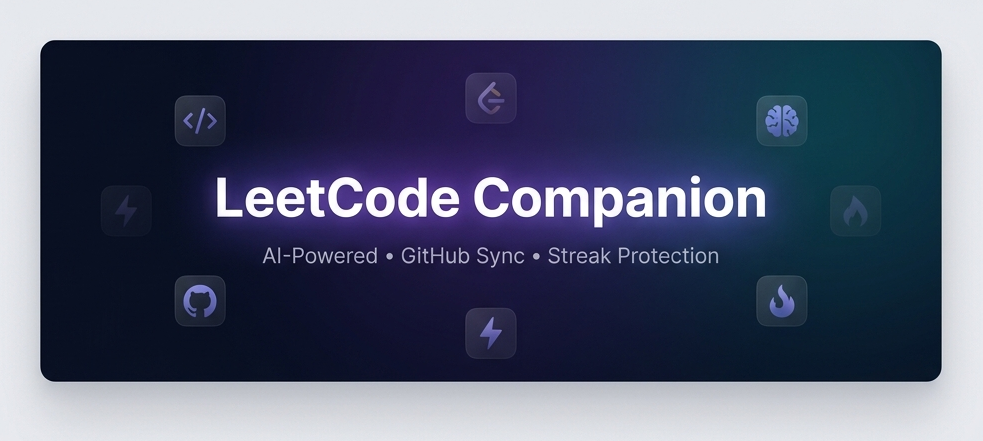
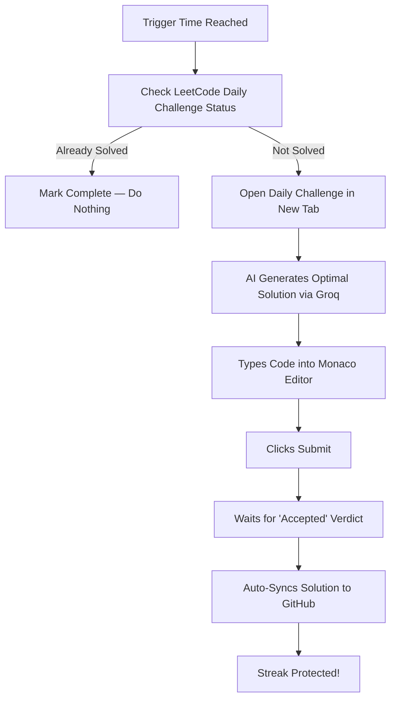
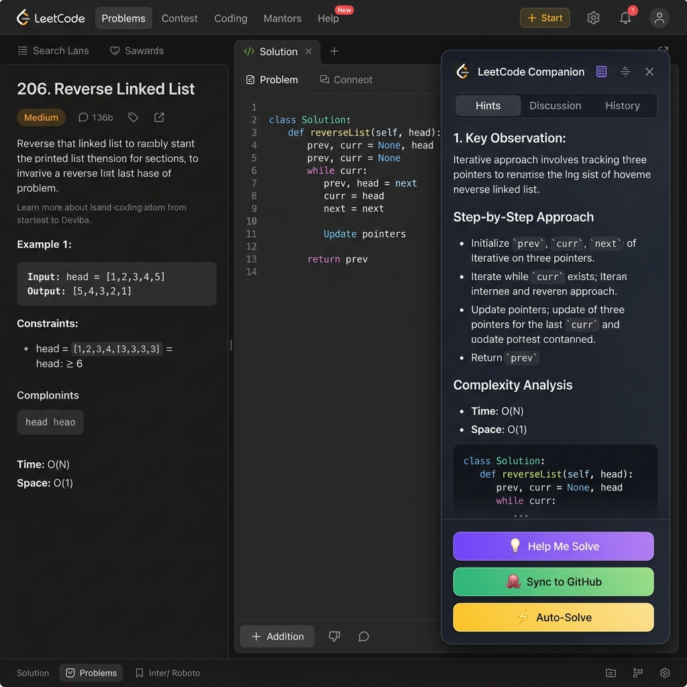
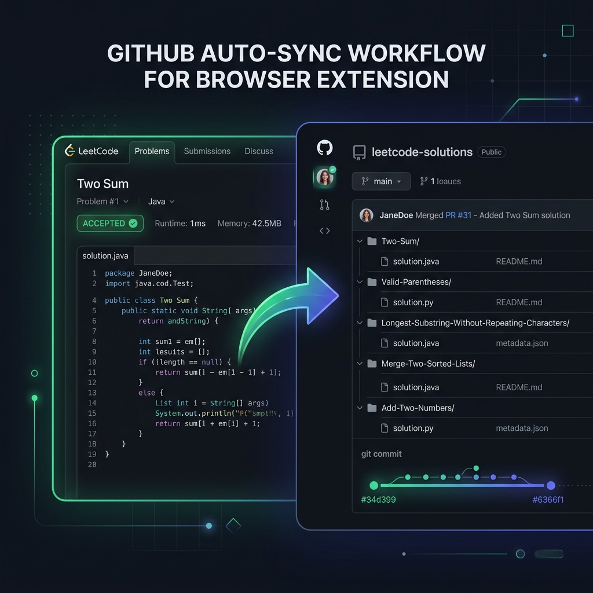

<div align="center">

  

  <br />
  <a href="https://git.io/typing-svg">
    
  </a>
  <br />
  <p><strong>Auto-solve LeetCode challenges to protect your streak, get AI hints, and sync code to GitHub.</strong></p>

  <p>
    <a href="https://chrome.google.com/webstore"></a>
    <a href="https://developer.chrome.com/docs/extensions/mv3/"></a>
    <a href="LICENSE"></a>
    <a href="https://github.com/Satyam810/leetcode-companion/pulls"></a>
  </p>

  <p>
    <a href="https://github.com/prettier/prettier"></a>
    <a href="#privacy--security"></a>
    <a href="https://groq.com"></a>
  </p>

  <p>
    Auto-Solve Streak Protection &nbsp;·&nbsp; AI-Powered Learning &nbsp;·&nbsp; Automatic GitHub Sync
  </p>

  <br />

  

</div>

<br />

---

## The Problem

You've been grinding LeetCode for **47 days straight**. You have a meeting, an exam, a deadline — and by the time you remember, it's midnight. **Streak gone. 47 days wasted.**

Or maybe you solved a problem, but forgot to save the code. Now it's lost in LeetCode's submission history. No GitHub profile contribution. No portfolio to show for your hard work.

**LeetCode Companion solves all of this — automatically.**

<br />

## What Makes This Different?

Most extensions only push your code to a repo. That's it. LeetCode Companion is a **complete AI-powered companion** that:

<table>
  <tr>
    <td align="center" width="33%">
      <h3>Protects</h3>
      <p>Auto-solves the daily challenge when you can't, so your streak <b>never breaks</b>.</p>
    </td>
    <td align="center" width="33%">
      <h3>Teaches</h3>
      <p>AI explains problems step-by-step in a beautiful floating sidebar so you actually <b>learn</b>.</p>
    </td>
    <td align="center" width="33%">
      <h3>Records</h3>
      <p>Every solution auto-syncs to GitHub, building your <b>coding portfolio</b>.</p>
    </td>
  </tr>
</table>

> [!NOTE]
> **One extension. Three superpowers. Zero effort.**

<br />

---

## Core Features

### 1. Streak Protection (Auto-Solve Pipeline)
*Set a time. Forget about it. Your streak is safe forever.*

LeetCode resets the daily challenge at midnight UTC. If life gets in the way and you can't solve it, LeetCode Companion has your back. 

```
You set trigger time to 10:00 PM
Every 60 seconds, the extension checks: "Did the user solve today's daily challenge?"
If YES → Silently marks the day as done. Nothing happens.
If NO and it's past 10:00 PM → Auto-solve activates:
```

#### The Auto-Solve Pipeline:


> [!TIP]
> **Smart Deduplication** — If you solve the problem manually at any point during the day, the auto-solver detects it and does nothing. No duplicate submissions. No duplicate GitHub commits.

---

### 2. AI-Powered Learning Assistant
*Don't just solve problems. Understand them.*

<div align="center">
  
</div>

When you're stuck on a problem, click **"Help Me Solve"** to open a premium draggable panel containing:

- **Step-by-Step Approach**: Breaks down the problem into digestible steps and identifies the underlying pattern (Two Pointers, DP, Graph, etc.).
- **Interactive Follow-Up Chat**: Ask follow-up questions in natural language, request optimizations, or clarify edge cases.
- **Supercharged Speed**: Powered by **Groq LLaMA 3.3 70B** for near-instant responses.

---

### 3. Intelligent GitHub Sync
*Every problem you solve automatically becomes a GitHub contribution.*

<div align="center">
  
</div>

Every synced solution is enriched and organized with clean file headers containing the problem description, difficulty level, and code formatted in comments matching the target language.

#### Clean Repository Structure:
```
📂 leetcode-solutions/
│
├── 📂 two-sum/
│   └── 📄 solution.py              ← includes full problem description
│
├── 📂 valid-parentheses/
│   └── 📄 solution.js              ← with JSDoc-style problem header
│
└── ... (auto-organized by problem slug)
```

<br />

---

## Quality-of-Life Details

Apart from the core pillars, LeetCode Companion has been built with secondary failsafes and design details to ensure a seamless interface:

*   **Adaptive Theme Observer:**
    The injected panel doesn't stick out. It uses a MutationObserver to actively monitor LeetCode's active theme. If you toggle LeetCode between Light and Dark mode, the panel dynamically matches the page's styling variables.
*   **Double-Counting Protection:**
    A smart 120-second active submit event check prevents the extension from double-counting your solved problems when refreshing tabs, reloading submission history, or viewing past code submissions.
*   **Out-of-Session Warning System:**
    If you log out of LeetCode, the extension actively reads editor warnings and DOM text to immediately flag the session timeout. Instead of failing silently, it will overlay a beautiful session expiration warning card on the page panel and toolbar.
*   **Markdown-Formatted File Commits:**
    All problem descriptions fetched from LeetCode are automatically cleaned using an integrated `htmlToMarkdown` parser, ensuring descriptions, list constraints, and examples look beautiful in your repo comment blocks.
*   **Dual-Source Description Engine:**
    If LeetCode limits GraphQL descriptions (common on Premium-only problems), the extension automatically falls back to DOM-scraped text with an expanded `20,000` character limit to ensure no descriptions are missing.
*   **Edge-Snapping Draggable Panel:**
    The page panel can be positioned anywhere on the screen by dragging the header, and snaps magnetically to the left or right screen borders when released.
*   **Real-Time Bidirectional Sync:**
    Settings toggled in your Chrome Toolbar dashboard (such as trigger schedules) are instantly updated inside LeetCode's active tab without requiring page reloads.
*   **Resilient Model Fallback Chain:**
    If Groq LLaMA 3.3 70B encounters rate limits or goes offline, the AI client automatically fails over to LLaMA 3.1 8B, ensuring zero disruptions during streak protection.

<br />

---

## Installation & Try It Out

> [!IMPORTANT]
> **Chrome Web Store Launch Progress:** I am actively working hard to publish LeetCode Companion to the Chrome Web Store as soon as possible! Once reviewed and approved by Google, you will be able to install it with a single click.
> 
> In the meantime, you can easily load and test the extension locally on your browser by following the step-by-step setup guide below.

### Step-by-Step Setup Guide

#### Option A: Clone the Repository (Recommended)
1. **Clone the project** to your local machine using git:
   ```bash
   git clone https://github.com/Satyam810/leetcode-companion.git
   cd leetcode-companion
   ```

#### Option B: Download ZIP File
1. Scroll to the top of this repository page.
2. Click the green **Code** button and select **Download ZIP**.
3. Extract the downloaded `.zip` archive to a folder on your computer.

---

### Loading into Google Chrome / Chromium Browsers

1. Open your browser and navigate to **`chrome://extensions/`** (or click the 3-dot menu → **Extensions** → **Manage Extensions**).
2. Enable **Developer mode** by toggling the switch in the top-right corner.
3. Click the **Load unpacked** button in the top-left corner.
4. Select the root folder (`leetcode-companion` folder containing the `manifest.json` file).
5. That's it! **LeetCode Companion** is now installed and active on your browser. Ready to protect your streak!

---

## Setup Guide

### Step 1: Get Your Free Groq AI Key
1. Go to **[console.groq.com](https://console.groq.com)** and sign up *(completely free)*.
2. Navigate to **API Keys** → **Create API Key** and copy it.

### Step 2: Create a GitHub Personal Access Token
1. Go to **[GitHub → Settings → Developer Settings → Tokens (classic)](https://github.com/settings/tokens)**.
2. Click **Generate new token (classic)** and select the **`repo`** scope.

### Step 3: Configure the Extension
1. Click the **LeetCode Companion** icon in your toolbar.
2. Open the **⚙️ Settings** page and fill in your credentials:
   - **GitHub Repo**: In `username/repo` format (e.g. `Satyam810/leetcode-solutions`).
   - **Groq API Key**: `gsk_...`
3. Click **Save Settings** & **Test Connection** to verify both are connected!

<br />

---

## Architecture

```
leetcode-companion/
│
├── manifest.json                    # Chrome Extension Manifest V3
├── LICENSE                          # MIT License
│
├── 📂 assets/
│   ├── 📂 icons/                    # Extension icons
│   └── 📂 screenshots/             # README screenshots
│
└── 📂 src/
    ├── 📂 background/
    │   └── service-worker.js        # Background Service Worker (Streak monitoring & API routing)
    │
    ├── 📂 content/
    │   ├── detector.js              # Observes DOM for "Accepted" submissions
    │   ├── injector.js              # Injects premium floating sidebar and dashboard UI
    │   └── editor-injector.js       # Bridge to Monaco editor (types AI solutions)
    │
    ├── 📂 lib/
    │   ├── groq-api.js              # Groq API Wrapper with auto-fallback models
    │   ├── github-api.js            # GitHub REST API client
    │   └── storage.js               # Chrome storage helpers (real-time sync)
    │
    └── 📂 popup/
        ├── popup.html / popup.js    # Popup Dashboard
        └── settings.html / settings.js  # SaaS-grade settings panel
```

<br />

---

## Privacy & Security

We take your privacy seriously. **All logic runs locally on your browser.**
- **API Keys**: Stored in Chrome's encrypted `storage.sync`.
- **Your Code**: Sent directly to Groq (for AI help) and GitHub (for sync) — never through any third-party server.
- **Zero Tracking**: No telemetry, no analytics, no third-party scripts.

<br />

---

## Author

<div align="center">

**Built with ❤️ by Satyam**

[](https://github.com/Satyam810)
[](https://www.linkedin.com/in/satyamlpu/)
[](https://medium.com/@satyamvatsa810)
[](https://satyam-portfoli.vercel.app/)

</div>

<br />

---

<div align="center">

### Show your support by starring the repository!
<sub>Made with ⚡ by <a href="https://github.com/Satyam810">Satyam</a></sub>

</div>
